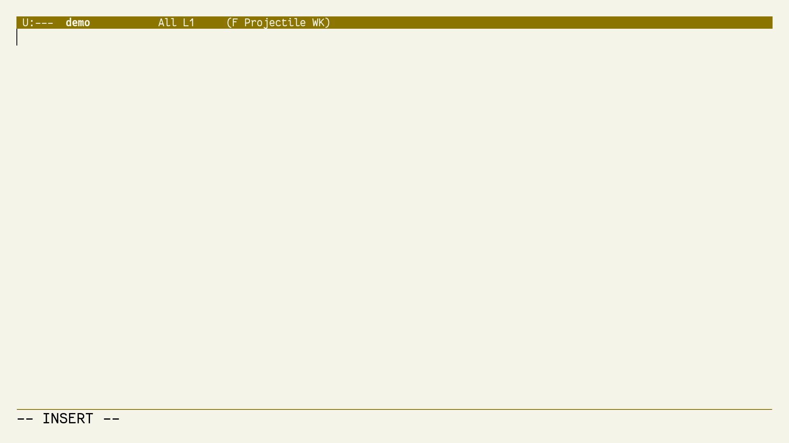

# lam: Local Abbrev Manager

Buffer local `abbrev`s at the speed of light!



The aim is to lower the barrier to define, use and discard context specific shortcuts.

## Installation

Not on melpa yet. For now:
```
$ git clone https://github.com/ChanderG/lam
```
and then in your init file:
```
(load "<path to lam>/lam")
```

Bind it to a convenient key, for eg:
```
(global-set-key "\C-xl" 'lam/control)
```
Now, you can use `C-x l` as a single keybinding to do everything - enable lam for current buffer, bring up the lam panel, close it, etc.

## Usuage

### Basic

Just type abbrevations into the `*lam*` buffer for them to become instantly available. Abbrevs are reloaded when you switch window focus - no saving or extra commands required!

Abbrev definitions look like the following:
```
("eia" "Emacs is Awesome!")
("lam" "Local Abbrev Manager")
```

You can comment out lines using ";". Since the `*lam*` buffer is reloaded on window focus change with no extra effort from your side: changing abbrev values, adding, removing, commenting, uncommenting all work seamlessly.

### Executing Elisp

But, wait. Abbrevs can do a lot more. Did you know that we can call arbitrary elisp from abbrevs?

If there is a third arg, it is wrapped into a lambda and called after expansion. The second arg is expanded first - you may not want to use it in this case.
```
("sayhi" "" (message "Hi"))
```
Will echo "Hi" to the minibuffer.

Just think of the possibilities!!!

#### Binding Key Sequences

If you don't remember/can't be bothered to lookup exact elisp functions, you can use the following approach to bind key sequences.

For example in `org-mode`, we can insert timestamps using `C-c .`. But, to add a timestamp for current time with the time portion requires 2 universal prefixes. The key sequence is thus: `C-u C-u C-c .`. In some workflows (not all - this is important, otherwise I would just bind a global abbrev), I insert a lot of timestamps as I take notes.

The "right" way to do this would be:
+ Look up help using `C-h k` to figure out the right function being called: `org-time-stamp`
+ Understand that 2 `C-u`'s translates to an arg of '(16). That took me some time to figure out! See this: http://xahlee.info/emacs/emacs/elisp_universal_argument.html

Finally, we can bind this as:
```
("Now" "" (org-time-stamp '(16)))
```

Instead of all this effort, you can do:
```
("Now" "" (execute-kbd-macro (read-kbd-macro "C-u C-u C-c .")))
```

But, even this is too much, so we provide an easy to use macro that does exactly this:
```
("Now" "" (lam/kbd "C-u C-u C-c ."))
```

#### Using Clipboard data

You can use external data directly from the elisp execution mode for custom abbrevations. Consider the following example:
```
("fn" "" (insert "\\footnote{" (substring-no-properties (x-get-clipboard)) "}"))
```
which inserts a footnote into a Latex file at point using whatever is in your clipboard - a url of the website for example that you just copied.

To simplify this use case, we provide a convenience macro `lam/cb` that does just this:
```
("fn" "" (insert "\\footnote{" (lam/cb) "}"))
```

## Possible Features/TODOs

1. Add a command to easily add abbrev for word under cursor.
2. Command to directly add sexp at point into lam and delete it out: allowing seamless adding of entried from primary buffer.
3. Highlight candidates for abbrev by word length and frequency
4. Support multiple lam buffers.
5. Save/load lam buffers.
6. Use a single lam buffer for an entire project

## LICENSE

MIT
